# User Flow & LLM Interactions

## Overview Flowchart

```mermaid
flowchart TD
    subgraph "1. User Input"
        A[User enters query + optional image] --> B[POST /api/recommend]
    end

    subgraph "2. Job Identification"
        B --> C{cached_job?}
        C -->|Yes| D[Use cached job]
        C -->|No| E[🤖 LLM: identify_job]
        E --> F[JobIdentification result]
        D --> F
        F --> G[_ensure_required_dimensions]
        G --> H[Validate categories against catalog]
    end

    subgraph "3. Clarification Check"
        H --> I[Merge inferred + user selections]
        I --> J[Get required fit dimensions]
        J --> K{Required dims missing?}
        K -->|No| M[Skip to recommendation]
        K -->|Yes| L[🤖 LLM: clarification inference]
        L --> N{Still missing after LLM?}
        N -->|No| M
        N -->|Yes| O[Return need_clarification response]
        O --> P[User selects options]
        P --> B
    end

    subgraph "4. Product Selection"
        M --> Q[select_candidates_dynamic]
        Q --> R{Candidates found?}
        R -->|No| S[Return 404 error]
        R -->|Yes| T[Build grounding context]
    end

    subgraph "5. Recommendation"
        T --> U[🤖 LLM: recommendation]
        U --> V[Parse product rankings]
        V --> W[Build response with primary/optional/tools]
        W --> X[Return JSON to frontend]
    end

    subgraph "6. Frontend Display"
        X --> Y[Render product sections]
        Y --> Z[Primary Products]
        Y --> AA[Optional Products with reasons]
        Y --> AB[Tools with reasons]
    end
```



## Sequence Diagram - Happy Path


## Sequence Diagram - Clarification Needed


## Data Flow Summary

| Step | Input | LLM Call? | Output |
|------|-------|-----------|--------|
| 1. Job Identification | problem_text, image | ✅ Yes | categories, inferred_values, missing_dimensions |
| 2. Dimension Check | JobIdentification | ❌ No | required_missing list |
| 3. Clarification | missing dims, context | ✅ Maybe | inferred_values OR need_clarification |
| 4. Candidate Selection | categories, fit_values | ❌ No | filtered products per category |
| 5. Recommendation | candidates, context | ✅ Yes | rankings, diagnosis, sections |

## Key Data Structures

### JobIdentification
```python
{
    "primary_categories": ["drivetrain_chains"],      # User asked for
    "optional_categories": ["drivetrain_cassettes"],  # LLM suggests for job
    "required_tools": ["tools_by_category_drivetrains"],
    "optional_reasons": {"drivetrain_cassettes": "Worn chain may have damaged cassette"},
    "tool_reasons": {"tools_by_category_drivetrains": "Chain tool needed"},
    "inferred_values": {"gearing": 12, "use_case": null},
    "missing_dimensions": ["use_case"],  # Couldn't determine
    "confidence": 0.85,
    "reasoning": "User needs 12-speed chain replacement"
}
```

### API Response (Success)
```python
{
    "diagnosis": "...",
    "sections": {"why_it_fits": [...], "suggested_workflow": [...], "checklist": [...]},
    "primary_products": [{"category": "Chains", "best": {...}, "alternatives": [...]}],
    "optional_products": [{"category": "Cassettes", "reason": "...", ...}],
    "tool_products": [{"category": "Tools", "reason": "...", ...}],
    "job": {...},
    "fit_values": {"gearing": 12, "use_case": "road"}
}
```

### API Response (Need Clarification)
```python
{
    "need_clarification": true,
    "job": {...},
    "missing_dimensions": ["gearing"],
    "options": {"gearing_options": ["8-speed", "9-speed", ...]},
    "hints": {"gearing": "Count the cogs on your rear cassette..."},
    "inferred_values": {}
}
```

## Files & Responsibilities

| File | Responsibility |
|------|----------------|
| `api.py` | Orchestrates flow, routes, response building |
| `job_identification.py` | LLM call #1: identify categories & dimensions |
| `categories.py` | Category definitions, required_fit dimensions |
| `candidate_selection.py` | Filter products by category & fit values |
| `prompts.py` | Build LLM prompts for clarification & recommendation |
| `templates/index.html` | Frontend state machine, API calls, rendering |

## VS Code Extensions for Viewing

1. **Markdown Preview Mermaid Support** (`bierner.markdown-mermaid`) - View in VS Code
2. **Mermaid Markdown Syntax Highlighting** - Syntax colors
3. GitHub renders Mermaid natively in markdown files

## Updating This Document

When you change the flow:
1. Update the relevant diagram
2. Keep data structure examples current
3. Use `🤖` emoji to mark LLM calls for quick scanning
