# User Flow & LLM Interactions

## Overview Flowchart

```mermaid
flowchart TD
    subgraph "1. User Input"
        A[User enters query + optional image] --> B[POST /api/recommend]
    end

    subgraph "2. Job Identification"
        B --> C{cached_job?}
        C -->|Yes| D[Use cached job]
        C -->|No| E[🤖 LLM: identify_job]
        E --> F[JobIdentification result]
        D --> F
        F --> G[Extract categories from instructions]
        G --> H[Validate categories against catalog]
    end

    subgraph "3. Clarification Check"
        H --> I[Check unclear_specifications]
        I --> J{Unanswered specs OR<br/>required dims missing?}
        J -->|No| M[Skip to recommendation]
        J -->|Yes| K[Return clarification_questions]
        K --> L[User answers ALL questions at once]
        L --> B
    end

    subgraph "4. Product Selection"
        M --> N[select_candidates_dynamic]
        N --> O[Get products for each referenced category]
    end

    subgraph "5. Final Recommendation"
        O --> P[Build recommendation context]
        P --> Q[🤖 LLM: final recommendation]
        Q --> R[Finalize instructions with product names]
        R --> S[Return response to frontend]
    end

    subgraph "6. Frontend Display"
        S --> T[Render final instructions]
        T --> U[Primary Products with reasoning]
        T --> V[Tools with reasoning]
        T --> W[Optional Extras max 3]
    end
```



## Sequence Diagram - Happy Path (No Clarification)


## Sequence Diagram - Clarification Needed


## Data Flow Summary

| Step | Input | LLM Call? | Output |
|------|-------|-----------|--------|
| 1. Job Identification | problem_text, image | ✅ Yes | instructions, unclear_specifications |
| 2. Category Extraction | instructions | ❌ No | list of category keys |
| 3. Clarification Check | unclear_specs | ❌ No | clarification_questions OR proceed |
| 4. Product Selection | categories, answers | ❌ No | products per category |
| 5. Final Recommendation | context + products | ✅ Yes | final_instructions, product selections |

## Key Data Structures

### JobIdentification (New Format)
```python
{
    "instructions": [
        "Step 1: Remove the old chain using a chain tool [drivetrain_tools].",
        "Step 2: Measure the new [drivetrain_chains] to match the old chain length.",
        "Step 3: Install the new chain and connect with a quick-link."
    ],
    "unclear_specifications": [
        {
            "spec_name": "drivetrain_speed",
            "confidence": 0.3,
            "question": "How many speeds is your drivetrain?",
            "hint": "Count the cogs on your rear cassette or check your shifter.",
            "options": ["8-speed", "9-speed", "10-speed", "11-speed", "12-speed"]
        }
    ],
    "referenced_categories": ["drivetrain_chains", "drivetrain_tools"],
    "confidence": 0.85,
    "reasoning": "User needs to replace their bicycle chain"
}
```

### Clarification Question
```python
{
    "spec_name": "brake_rotor_diameter",
    "confidence": 0.4,
    "question": "What is the diameter of your brake rotors?",
    "hint": "Measure across the rotor or check the number printed on it (e.g., 160mm, 180mm).",
    "options": ["140mm", "160mm", "180mm", "200mm", "203mm"]
}
```

### API Response - Need Clarification
```python
{
    "need_clarification": true,
    "job": {...},  # Full JobIdentification
    "clarification_questions": [
        {"spec_name": "...", "question": "...", "hint": "...", "options": [...]}
    ],
    "instructions_preview": [  # Shows preliminary instructions
        "Step 1: ...",
        "Step 2: ..."
    ],
    "inferred_values": {"use_case": "road"}
}
```

### API Response - Success
```python
{
    "diagnosis": "Complete chain replacement with proper tools.",
    "final_instructions": [
        "Step 1: Remove the old chain using the Park Tool CT-3.2 Chain Tool.",
        "Step 2: Measure and cut the new Shimano CN-M8100 12-Speed Chain to match.",
        "Step 3: Install with the included quick-link, ensuring proper direction."
    ],
    "primary_products": [
        {
            "category": "drivetrain_chains",
            "category_display": "Chains",
            "product": {"name": "...", "brand": "...", "price": "...", "url": "..."},
            "reasoning": "12-speed chain compatible with your Shimano drivetrain."
        }
    ],
    "tools": [
        {
            "category": "drivetrain_tools",
            "category_display": "Drivetrain Tools",
            "product": {...},
            "reasoning": "Required for chain removal and installation."
        }
    ],
    "optional_extras": [  # Max 3 items
        {
            "category": "drivetrain_cassettes",
            "product": {...},
            "reasoning": "Worn chains often damage cassettes - consider replacing together."
        }
    ],
    "job": {...},
    "fit_values": {"gearing": 12, "use_case": "road"}
}
```

## LLM Prompts

### 1. Job Identification Prompt
**Input:** User problem text, optional image, list of valid category keys
**Output:** Step-by-step instructions with `[category_key]` references, unclear specifications

Key prompt features:
- Instructions must reference categories using exact keys in `[brackets]`
- LLM self-assesses confidence for ALL technical specifications
- Specs with confidence < 0.8 go into `unclear_specifications`
- Each unclear spec includes question, hint, and 2-5 options

### 2. Final Recommendation Prompt
**Input:** Original request, instructions, clarification answers, products by category
**Output:** Finalized instructions with product names, product selections with reasoning

Key prompt features:
- Replace category references with actual product names from data
- If no matching product: note "no fitting product available" and suggest what to look for
- Select primary products, tools, and max 3 optional extras
- Each product selection includes 1-2 sentence reasoning

## Files & Responsibilities

| File | Responsibility |
|------|----------------|
| `api.py` | Orchestrates flow, routes, response building |
| `job_identification.py` | LLM call #1: generate instructions & identify unclear specs |
| `categories.py` | Category definitions, required_fit dimensions |
| `candidate_selection.py` | Filter products by category & fit values |
| `prompts.py` | Build LLM prompts for recommendation |
| `templates/index.html` | Frontend: clarification UI, product display |

## Frontend Clarification UI

When `need_clarification: true`:
1. Show **all** clarification questions at once
2. Each question displays:
   - The question text
   - A hint with 💡 icon (styled as info box)
   - Option buttons (2-5 options)
   - "Other" button for custom text entry
3. User can answer in any order
4. Submit button enabled when all answered

## VS Code Extensions for Viewing

1. **Markdown Preview Mermaid Support** (`bierner.markdown-mermaid`) - View in VS Code
2. **Mermaid Markdown Syntax Highlighting** - Syntax colors
3. GitHub renders Mermaid natively in markdown files

## Updating This Document

When you change the flow:
1. Update the relevant diagram
2. Keep data structure examples current
3. Use `🤖` emoji to mark LLM calls for quick scanning
